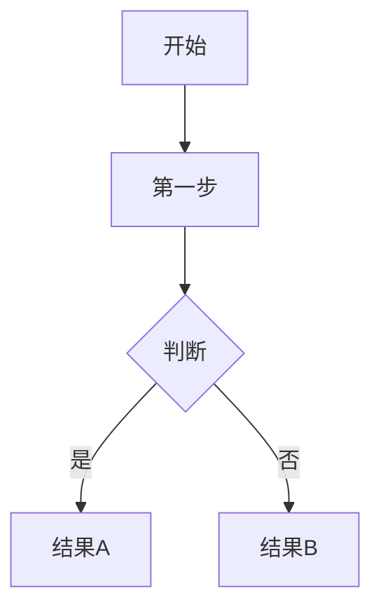

# douyin-transcribe

将抖音视频（或本地视频文件）转录为文本，并由 Claude 用大白话解释内容。使用 faster-whisper 本地推理，不依赖外部 API。

## Claude 解释模式（主要用法）

当用户给你一个抖音链接并要求解释视频内容时，执行以下流程：

**Step 1：转录**

```bash
# macOS/Linux
cd "$(git -C "$(dirname "$0")" rev-parse --show-toplevel 2>/dev/null || echo ~/Desktop/claude-context)/shared/skills/douyin-transcribe"
source .venv/bin/activate

# Windows (PowerShell)
# cd "$env:USERPROFILE\Desktop\claude-context\shared\skills\douyin-transcribe"
# .venv\Scripts\Activate.ps1

python scripts/transcribe_douyin.py "<链接>" -o transcript_tmp.txt
```

**Step 2：读取转录文本**

读取 `transcript_tmp.txt` 的内容。

**Step 3：用大白话解释**

拿到转录文本后，按以下原则解释：

- 用普通人能听懂的语言，不用专业术语堆砌
- 以连贯的段落为主，不要把所有内容拆成 bullet points
- 如果视频讲的是一个流程、步骤、或因果关系，用 mermaid flowchart 来呈现，比文字更清楚
- 如果视频讲的是对比、数据、结构性内容，可以用表格
- 解释完后，给出你自己对这个内容的判断：这个说法靠谱吗？有没有值得注意的地方？

**mermaid flowchart 示例格式：**



## 用法

```bash
# 抖音链接
python scripts/transcribe_douyin.py "https://v.douyin.com/xxxxxxx/"

# 本地文件
python scripts/transcribe_douyin.py video.mp4

# 同时输出 SRT 字幕
python scripts/transcribe_douyin.py "https://v.douyin.com/xxxxxxx/" --srt

# 指定输出路径
python scripts/transcribe_douyin.py "https://v.douyin.com/xxxxxxx/" -o result.txt

# 更大模型（更准）
python scripts/transcribe_douyin.py "https://v.douyin.com/xxxxxxx/" --model medium

# 受限视频需要浏览器 cookies
python scripts/transcribe_douyin.py "https://v.douyin.com/xxxxxxx/" --cookies-from-browser edge

# GPU 加速
python scripts/transcribe_douyin.py "https://v.douyin.com/xxxxxxx/" --device cuda --compute-type float16
```

## 参数

| 参数 | 默认值 | 说明 |
|------|--------|------|
| `--model` | `small` | Whisper 模型：tiny/base/small/medium/large-v3 |
| `--device` | `cpu` | 运行设备：cpu 或 cuda |
| `--compute-type` | `int8` | CPU 推荐 int8，GPU 可用 float16 |
| `--srt` | 否 | 同时输出 .srt 字幕文件 |
| `--cookies-from-browser` | 无 | 浏览器 cookies，如 `edge` 或 `chrome` |
| `-o` / `--output` | 自动命名 | 输出 txt 路径 |

## 安装

```bash
cd shared/skills/douyin-transcribe
python -m venv .venv

# Windows
.venv\Scripts\activate
# macOS/Linux
source .venv/bin/activate

pip install -r requirements.txt
```

## 依赖

- `faster-whisper==1.1.1` — 本地 Whisper 推理
- `yt-dlp>=2025.1.0` — 视频下载/流解析

## 说明

- 语言固定为中文（`language=zh`）
- 视频链接不落地保存，直接流式转写
- 抖音链接会自动跟随重定向解析真实流地址
- 首次运行会自动下载 Whisper 模型（small 约 500MB）
